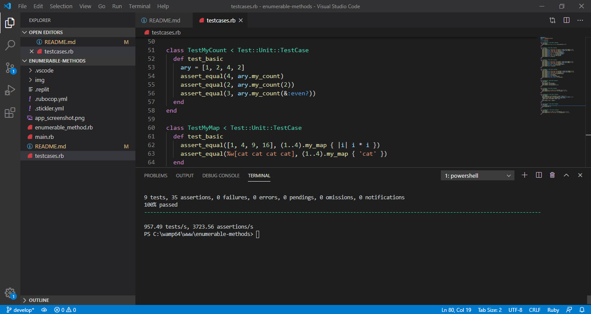

# Bubble sort array

## Project specifications

bubble sort, where each element is compared to the one next to it and they are swapped if the one on the left is larger than the one on the right. This continues until the array is eventually sorted. 

## Link to assignment

the assignment can be found  [here](https://www.theodinproject.com/courses/ruby-programming/lessons/advanced-building-blocks).

## Built With

Concepts used on this project

- Ruby
- Loops
- Yield

Tools used on this project

- Visual Studio Code
- VSCode Ruby by Stafford Brunk
- Rufo (Ruby Formatter) by Matt Bessey

## Screenshot

## Live Demo

You can see the [live preview](https://repl.it/@RubenPaz/bubble-sort-ruby)

## Authors

👤 **Xóchitl Selene Flores Pérez**

- Github: [@enelesmai](https://github.com/enelesmai)
- Twitter: [@enelesmai](https://twitter.com/enelesmai)
- Linkedin: [xochitlselene](https://linkedin.com/in/xochitlselene)

👤 **Ruben Paz Chuspe**

- Github: [@rubenpazch](https://github.com/rubenpazch)
- Linkedin: [rubenpch](https://www.linkedin.com/in/rubenpch/)

## Contributing

This is an education project as a part of the Microverse so contributing is not accepted. 

Contributions, issues and feature requests are welcome!

Feel free to check the [issues](https://github.com/rubenpazch/capstone-conference-page/issues).

## Show your support

Give a ⭐️ if you like this project!

## Acknowledgements

+ [Microverse](https://www.microverse.org/).
+ [Github](http://github.com/).
+ [The Odin Project](theodinproject.com/).

## License

This project is [MIT](lic.url) licensed.

